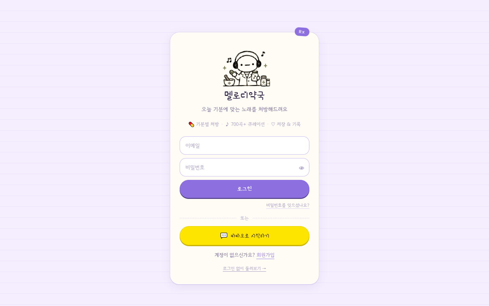
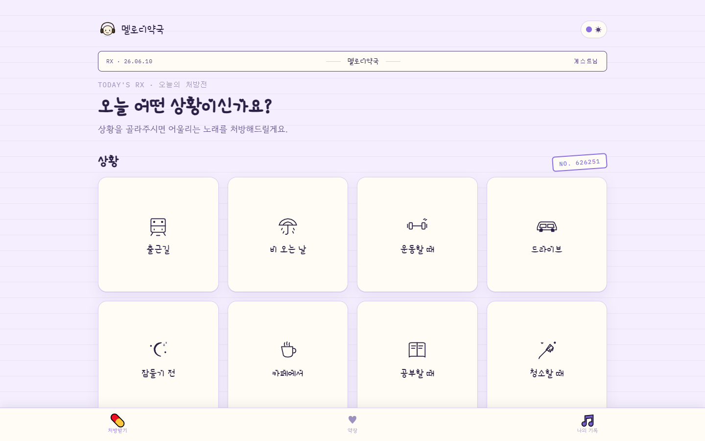
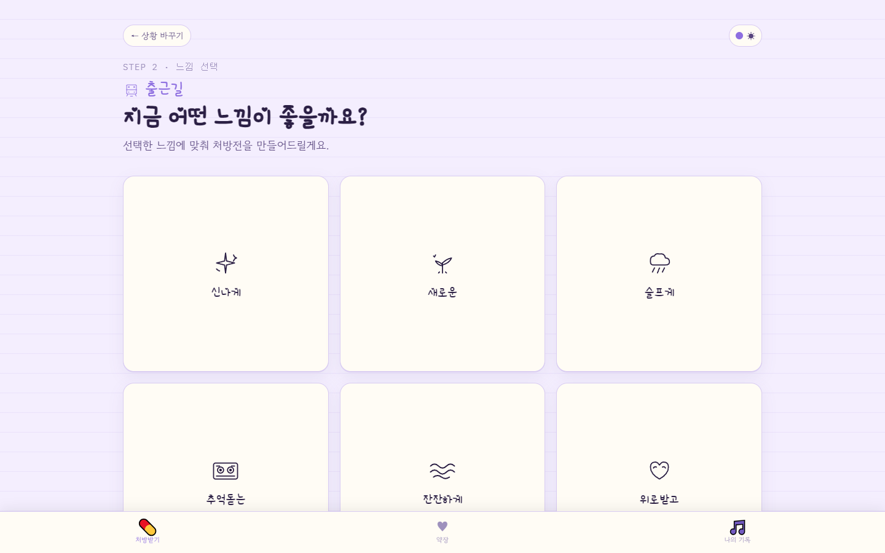
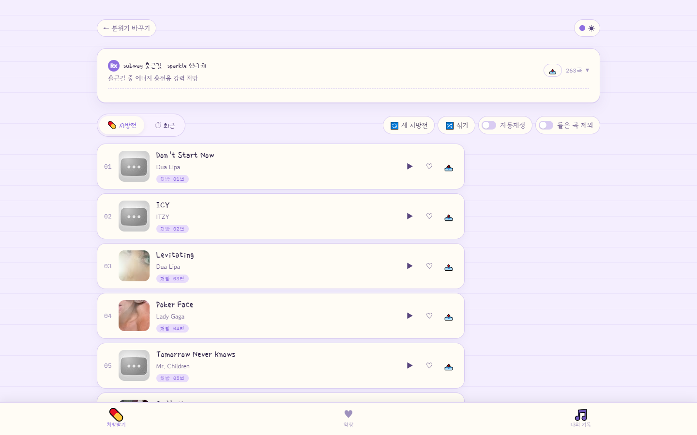
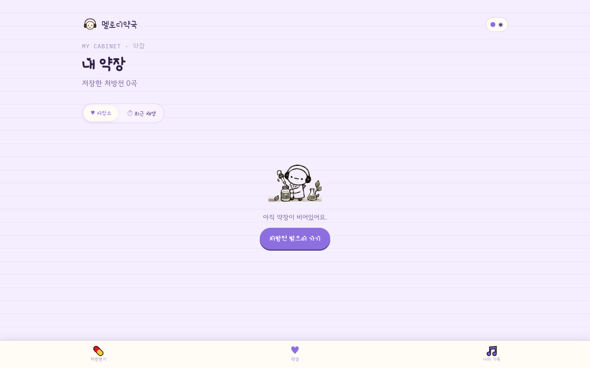
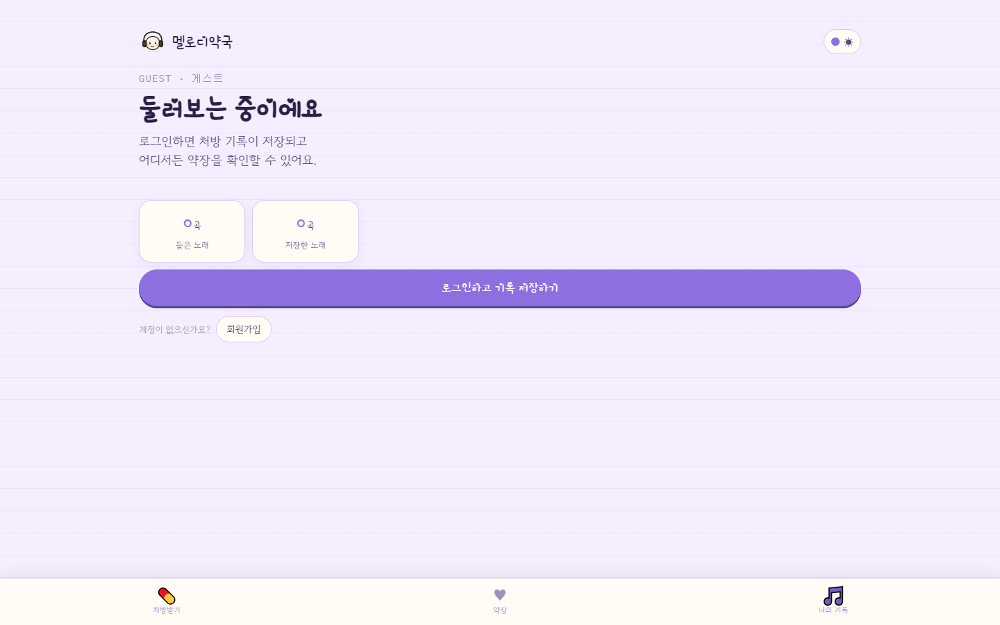

# 🎵 Melody Pharmacy

> **상황과 기분에 맞는 음악을 처방해드립니다**

약국 테마의 무드 기반 음악 추천 웹 앱입니다. 지금 내 상황(출근길, 카페에서, 운동할 때 등 8가지)과 원하는 느낌(신나게, 잔잔하게, 감성적으로 등 6가지)을 선택하면, 그 조합에 맞는 노래를 "처방전" 형식으로 추천해줍니다.

**48가지 조합 × AI + YouTube 기반 큐레이션 = 1,009곡 이상의 음악 라이브러리**

---

## 🖥️ 화면 미리보기

| 로그인 | 상황 선택 | 컨셉 선택 |
|---|---|---|
|  |  |  |

| 추천 결과 | 저장 목록 | 프로필 |
|---|---|---|
|  |  |  |

---

## ✨ 주요 기능

### 음악 추천
- **48가지 조합**: 8가지 상황 × 6가지 분위기로 맞춤 추천
- **최근 들은 곡 제외**: 7일 이내 재생 곡을 제외하고 새로운 곡 우선 추천
- **유튜브 플레이리스트 제안**: 각 조합에 맞는 큐레이션 플레이리스트 연결

### 계정 & 게스트 모드
- **게스트 모드**: 회원가입 없이 바로 탐색 → 저장 및 기록은 로컬에 보관
- **로그인 후 마이그레이션**: 게스트로 저장한 곡이 계정에 자동 이전
- **카카오 OAuth**: 카카오 계정으로 간편 로그인

### 내 약장 (보관함)
- 저장한 곡과 재생 기록을 상황/컨셉별로 필터링
- 제목·아티스트·저장일 기준 정렬 및 검색

### AI 기반 콘텐츠 보충 (자동)
- **Gemini 2.5 Flash**: 매일 새벽 2시, 곡이 부족한 조합에 AI로 신규 곡 자동 추가
- **YouTube Data API**: 매주 월요일 새벽 3시, 조회수 낮은 곡 제거 후 재보충

---

## 🛠️ 기술 스택

### Frontend
| 기술 | 버전 | 용도 |
|---|---|---|
| React | 19.2 | UI 라이브러리 |
| TypeScript | 6.0 | 타입 안정성 |
| Vite | 8.0 | 빌드 도구 |
| React Router DOM | 7.15 | SPA 라우팅 |
| Axios | 1.16 | HTTP 클라이언트 |
| Vite PWA Plugin | 1.3 | PWA 지원 |
| html2canvas | 1.4 | 처방전 이미지 저장 |

### Backend
| 기술 | 버전 | 용도 |
|---|---|---|
| Spring Boot | 3.2.5 | REST API 서버 |
| Java | 17 | 런타임 |
| MySQL 8 | - | 메인 데이터베이스 |
| Spring Security + JWT | - | 인증/인가 |
| Spring Data JPA | - | ORM |
| springdoc-openapi | 2.3.0 | API 문서 (Swagger) |

### 외부 API
| API | 용도 |
|---|---|
| **Kakao OAuth 2.0** | 소셜 로그인 |
| **Gemini 2.5 Flash** | AI 음악 추천 보충 |
| **YouTube Data API** | 영상 유효성 검증 + 조회수 기반 필터링 |

---

## 📁 프로젝트 구조

```
melody-pharmacy/
├── backend/                        # Spring Boot REST API (포트 8081)
│   └── src/main/java/
│       ├── controller/             # Auth, Song, Situation, Concept, Playlist, Admin
│       ├── service/                # 비즈니스 로직, Gemini/YouTube 연동
│       ├── entity/                 # User, Song, SongTag, UserSong, PlayHistory, PlaylistVideo
│       ├── security/               # JWT 필터, 토큰 프로바이더
│       └── config/                 # SecurityConfig, SongPoolScheduler (자동 보충)
│
└── frontend/                       # React + TypeScript SPA (포트 5173)
    └── src/
        ├── pages/                  # Main, Concept, Recommend, Saved, Profile, Login, Admin
        ├── api/                    # songApi.ts, guestApi.ts, authApi.ts
        ├── utils/guestMode.ts      # 게스트 모드 관리 + 서버 마이그레이션
        ├── data/guestData.ts       # 오프라인 폴백 데이터
        └── context/ThemeContext    # 다크/라이트 모드
```

---

## 📡 주요 API

| 메서드 | 엔드포인트 | 설명 |
|---|---|---|
| `GET` | `/api/situations` | 상황 목록 조회 |
| `GET` | `/api/concepts` | 컨셉 목록 조회 |
| `GET` | `/api/songs/recommend?situationId=X&conceptId=Y` | 노래 추천 |
| `GET` | `/api/songs/combo-counts?situationId=X` | 컨셉별 곡 수 조회 |
| `POST` | `/api/songs/{id}/save` | 노래 저장 |
| `GET` | `/api/songs/saved` | 저장한 노래 조회 |
| `GET` | `/api/songs/history` | 재생 기록 조회 |
| `POST` | `/api/auth/signup` | 회원가입 |
| `POST` | `/api/auth/login` | 로그인 (JWT 발급) |
| `GET` | `/api/auth/kakao?code=...` | 카카오 OAuth 처리 |

> Swagger UI: `http://localhost:8081/swagger-ui.html`

---

## 🏗️ 주요 설계 결정

### 게스트 모드 → 로그인 마이그레이션
회원가입 없이도 모든 기능을 사용할 수 있도록 `localStorage` 기반 게스트 모드를 구현했습니다. 로그인 시 `migrateGuestDataToServer()`가 로컬 저장 곡을 서버로 일괄 이전합니다.

### 3중 중복 방지
1. **DB 제약조건**: `(title, artist)` UNIQUE 인덱스
2. **Java 레이어**: 대소문자 무시 조회 후 저장
3. **AI 프롬프트**: 기존 곡 목록을 Gemini에 전달해 중복 생성 방지

### 자동 콘텐츠 보충 스케줄러
- 매일 새벽 2시: 곡이 적은 조합에 Gemini로 자동 보충 (일 20회 제한, 7초 간격)
- 매주 월요일 새벽 3시: YouTube 조회수 기준으로 오래된 영상 교체

---

## 📄 라이센스

MIT License
